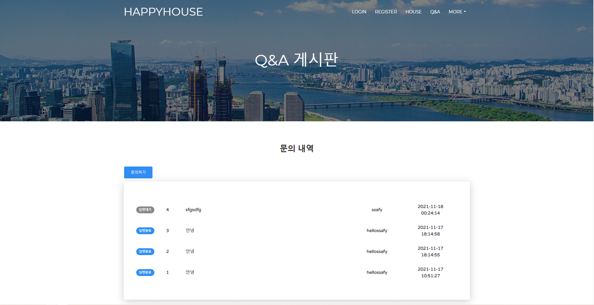
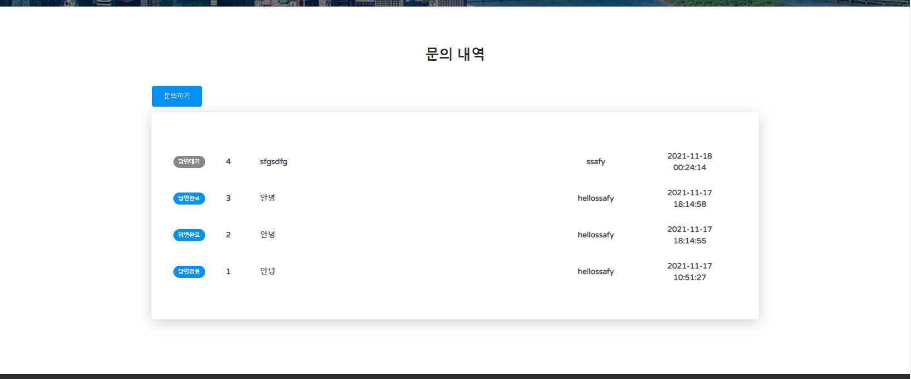

# pjt_daejeon_6th_class4_vue_team04

# 개발자
김지언, 송예인

# 기능
오전

- [x]  데이터베이스 구축
- [x]  Backend 서버 구축

오후

- [x]  메뉴에 QnA 게시판 추가 - 기본(필수) 기능
- [x]  QnA 게시글 목록 서비스 - 기본(필수) 기능
- [x]  QnA 게시글 입력 서비스 - 기본(필수) 기능
- [x]  상세 검색 서비스 - 기본(필수) 기능
- [ ]  QnA 게시글 수정 서비스 - 기본(필수) 기능
- [ ]  QnA 게시글 수정 서비스 - 기본(필수) 기능
- [X]  추가 기능 Vue에 적용

저녁

- [x]  결과(산출물) 작성

# 서버 구축
## DB Table 추가
```sql
CREATE TABLE `happyhouse`.`question` (
  `no` INT NOT NULL AUTO_INCREMENT,
  `title` VARCHAR(100) NOT NULL,
  `content` VARCHAR(1000) NOT NULL,
  `datetime` DATETIME NULL DEFAULT now(),
  `writer` VARCHAR(16) NOT NULL,
  `state` VARCHAR(45) NULL,
  PRIMARY KEY (`no`),
  FOREIGN KEY (`writer`) REFERENCES `happyhouse`.`member` (`userid`)
    ON DELETE CASCADE
    ON UPDATE CASCADE
  );
  
CREATE TABLE `happyhouse`.`answer` (
  `no` INT NOT NULL AUTO_INCREMENT,
  `content` VARCHAR(1000) NULL,
  `datetime` DATETIME NULL DEFAULT now(),
  `p_no` INT NOT NULL,
  PRIMARY KEY (`no`),
  FOREIGN KEY (`p_no`) REFERENCES `happyhouse`.`question` (`no`)
    ON DELETE CASCADE
    ON UPDATE CASCADE);
```

## RestController 구현
- QuestionController
```java
package com.ssafy.happyhouse.controller;

import java.util.List;

import org.slf4j.Logger;
import org.slf4j.LoggerFactory;
import org.springframework.beans.factory.annotation.Autowired;
import org.springframework.http.HttpStatus;
import org.springframework.http.ResponseEntity;
import org.springframework.web.bind.annotation.CrossOrigin;
import org.springframework.web.bind.annotation.DeleteMapping;
import org.springframework.web.bind.annotation.GetMapping;
import org.springframework.web.bind.annotation.PathVariable;
import org.springframework.web.bind.annotation.PostMapping;
import org.springframework.web.bind.annotation.PutMapping;
import org.springframework.web.bind.annotation.RequestBody;
import org.springframework.web.bind.annotation.RequestMapping;
import org.springframework.web.bind.annotation.RestController;

import com.ssafy.happyhouse.model.Question;
import com.ssafy.happyhouse.model.service.QuestionService;

import io.swagger.annotations.ApiOperation;

@CrossOrigin(origins = { "*" }, maxAge = 6000)
@RestController
@RequestMapping("/api/question")
public class QuestionController {
	private static final Logger logger = LoggerFactory.getLogger(QuestionController.class);
	private static final String SUCCESS = "success";
	private static final String FAIL = "fail";

	@Autowired
	private QuestionService questionService;

	@ApiOperation(value = "모든 문의글의 정보를 반환한다.", response = List.class)
	@GetMapping
	public ResponseEntity<List<Question>> retrieveQuestion() throws Exception {
		logger.debug("retrieveQuestion - 호출");
		return new ResponseEntity<List<Question>>(questionService.retrieveQuestion(), HttpStatus.OK);
	}

	@ApiOperation(value = "글번호에 해당하는 문의글의 정보를 반환한다.", response = Question.class)
	@GetMapping("{no}")
	public ResponseEntity<Question> detailQuestion(@PathVariable int no) {
		logger.debug("detailQuestion - 호출");
		return new ResponseEntity<Question>(questionService.detailQuestion(no), HttpStatus.OK);
	}

	@ApiOperation(value = "새로운 문의글 정보를 입력한다. 그리고 DB입력 성공여부에 따라 'success' 또는 'fail' 문자열을 반환한다.", response = String.class)
	@PostMapping
	public ResponseEntity<String> writeQuestion(@RequestBody Question question) {
		logger.debug("writeQuestion - 호출");
		if (questionService.writeQuestion(question)) {
			return new ResponseEntity<String>(SUCCESS, HttpStatus.OK);
		}
		return new ResponseEntity<String>(FAIL, HttpStatus.NO_CONTENT);
	}

	@ApiOperation(value = "글번호에 해당하는 문의글의 정보를 수정한다. 그리고 DB수정 성공여부에 따라 'success' 또는 'fail' 문자열을 반환한다.", response = String.class)
	@PutMapping
	public ResponseEntity<String> updateQuestion(@RequestBody Question question) {
		logger.debug("updateQuestion - 호출");
		logger.debug("" + question);

		if (questionService.updateQuestion(question)) {
			return new ResponseEntity<String>(SUCCESS, HttpStatus.OK);
		}
		return new ResponseEntity<String>(FAIL, HttpStatus.NO_CONTENT);
	}

	@ApiOperation(value = "글번호에 해당하는 문의글의 정보를 삭제한다. 그리고 DB삭제 성공여부에 따라 'success' 또는 'fail' 문자열을 반환한다.", response = String.class)
	@DeleteMapping("{no}")
	public ResponseEntity<String> deleteQuestion(@PathVariable int no) {
		logger.debug("deleteQuestion - 호출");
		if (questionService.deleteQuestion(no)) {
			return new ResponseEntity<String>(SUCCESS, HttpStatus.OK);
		}
		return new ResponseEntity<String>(FAIL, HttpStatus.NO_CONTENT);
	}
}
```
- AnswerController
```java
package com.ssafy.happyhouse.controller;

import org.slf4j.Logger;
import org.slf4j.LoggerFactory;
import org.springframework.beans.factory.annotation.Autowired;
import org.springframework.http.HttpStatus;
import org.springframework.http.ResponseEntity;
import org.springframework.web.bind.annotation.CrossOrigin;
import org.springframework.web.bind.annotation.DeleteMapping;
import org.springframework.web.bind.annotation.GetMapping;
import org.springframework.web.bind.annotation.PathVariable;
import org.springframework.web.bind.annotation.PostMapping;
import org.springframework.web.bind.annotation.PutMapping;
import org.springframework.web.bind.annotation.RequestBody;
import org.springframework.web.bind.annotation.RequestMapping;
import org.springframework.web.bind.annotation.RestController;

import com.ssafy.happyhouse.model.Answer;
import com.ssafy.happyhouse.model.service.AnswerService;

import io.swagger.annotations.ApiOperation;

@CrossOrigin(origins = { "*" }, maxAge = 6000)
@RestController
@RequestMapping("/api/answer")
public class AnswerController {
	private static final Logger logger = LoggerFactory.getLogger(AnswerController.class);
	private static final String SUCCESS = "success";
	private static final String FAIL = "fail";

	@Autowired
	private AnswerService answerService;

	@ApiOperation(value = "글번호에 해당하는 답글의 정보를 반환한다.", response = Answer.class)
	@GetMapping("{no}")
	public ResponseEntity<Answer> detailAnswer(@PathVariable int no) {
		logger.debug("detailAnswer - 호출");
		return new ResponseEntity<Answer>(answerService.detailAnswer(no), HttpStatus.OK);
	}

	@ApiOperation(value = "새로운 답글 정보를 입력한다. 그리고 DB입력 성공여부에 따라 'success' 또는 'fail' 문자열을 반환한다.", response = String.class)
	@PostMapping
	public ResponseEntity<String> writeAnswer(@RequestBody Answer answer) {
		logger.debug("writeAnswer - 호출");
		if (answerService.writeAnswer(answer)) {
			return new ResponseEntity<String>(SUCCESS, HttpStatus.OK);
		}
		return new ResponseEntity<String>(FAIL, HttpStatus.NO_CONTENT);
	}

	@ApiOperation(value = "글번호에 해당하는 답글의 정보를 수정한다. 그리고 DB수정 성공여부에 따라 'success' 또는 'fail' 문자열을 반환한다.", response = String.class)
	@PutMapping
	public ResponseEntity<String> updateAnswer(@RequestBody Answer answer) {
		logger.debug("updateAnswer - 호출");
		logger.debug("" + answer);

		if (answerService.updateAnswer(answer)) {
			return new ResponseEntity<String>(SUCCESS, HttpStatus.OK);
		}
		return new ResponseEntity<String>(FAIL, HttpStatus.NO_CONTENT);
	}

	@ApiOperation(value = "글번호에 해당하는 답글의 정보를 삭제한다. 그리고 DB삭제 성공여부에 따라 'success' 또는 'fail' 문자열을 반환한다.", response = String.class)
	@DeleteMapping("{no}")
	public ResponseEntity<String> deleteAnswer(@PathVariable int no) {
		logger.debug("deleteAnswer - 호출");
		if (answerService.deleteAnswer(no)) {
			return new ResponseEntity<String>(SUCCESS, HttpStatus.OK);
		}
		return new ResponseEntity<String>(FAIL, HttpStatus.NO_CONTENT);
	}
}
```


# 기본(필수) 기능
- QnA 게시글 목록 서비스



```javascript
<template>
  <div
    class="table standard"
    v-bind:class="{ 'dark-mode': darkModeOn }"
    :style="{ height: tableHeight + '%' }"
  >
    <div class="t-body">
      <div
        v-for="(array, index) in questionList"
        v-bind:key="index"
        @click="clickList(array.no, index)"
      >
        <div class="items">
          <badge
            :type="array.state == '답변대기' ? 'default' : 'primary'"
            class="text-center mb-0"
            >{{ array.state }}</badge
          >
          <div class="col-1 text-center">{{ array.no }}</div>
          <div class="col">{{ array.title }}</div>
          <div class="col-2 text-center">{{ array.writer }}</div>
          <div class="col-2 text-center">{{ array.dateTime }}</div>
        </div>
        <template v-if="isActive[index]">
          <div>{{ array.content }}</div>
          <template v-if="array.answer != null">
            <div>{{ array.answer.content }}</div>
            <div>{{ array.answer.dateTime }}</div>
          </template>
        </template>
      </div>
    </div>
  </div>
</template>

<script>
import axios from "axios";
import { Badge } from "@/components";

export default {
  name: "SimpleTable",
  components: {
    Badge,
  },
  props: {
    content: {
      type: Array,
    },
    tableHeight: { type: [String, Number] },
    columnsWidth: { type: [String, Number], default: 100 },
    darkModeOn: { type: Boolean, default: false },
  },
  data() {
    return {
      questionList: [],
      isActive: [],
    };
  },
  created() {
    this.questionList = this.content;
    this.isActive = new Array(this.questionList.length);
    // console.log(this.questionList);
  },
  methods: {
    clickList(no, index) {
      if (this.questionList[index].answer === null) {
        axios.get("http://localhost:9999/api/answer/" + no).then((resp) => {
          this.questionList[index].answer = resp["data"];
          console.log(this.questionList[index]);
        });
      }
      // console.log(resp["data"]);
      this.isActive[index] = !this.isActive[index];
    },
  },
};
</script>

<!-- Add "scoped" attribute to limit CSS to this component only -->
<style scoped>
@import url("https://fonts.googleapis.com/css2?family=Varela+Round&display=swap");
.standard {
  --background: #fff;
  --color-1: #f0f0f7;
  --color-2: #b1b3c4;
  --color-3: #f5f5f7;
  --color-4: #e4e5f1;
  --color-5: #4b4a54;
}
.dark-mode {
  --background: #151618;
  --color-1: #222426;
  --color-2: #bfc0c1;
  --color-3: #191a1c;
  --color-4: #27282c;
  --color-5: #b9b9ba;
}
::-webkit-scrollbar {
  width: 10px;
}
/* Track */
::-webkit-scrollbar-track {
  background: transparent;
}
/* Handle */
::-webkit-scrollbar-thumb {
  background: var(--color-4);
  border-radius: 5px;
}
p {
  margin: 0;
  padding: 0;
}
.table {
  background: var(--background);
  border-radius: 5px;
  padding: 20px;
  width: 100%;
  height: fit-content;
  font-family: "Varela Round", sans-serif;
  font-weight: 600;
  position: relative;
  overflow-y: auto;
}
.titles {
  display: flex;
  flex-direction: row;
  background: var(--color-1);
  padding: 15px 0;
  border-radius: 5px;
}
.titles p {
  padding: 0 10px;
  color: var(--color-2);
}
.items {
  cursor: pointer;
  display: flex;
  flex-direction: row;
  margin-top: 5px;
  padding: 10px 0;
  color: var(--color-5);
  transition: all 0.3s ease 0s;
  justify-content: space-between;
  align-items: center;
}
.items:nth-child(even) {
  background-color: var(--color-3);
  /* border-radius: 5px; */
}
.items:hover {
  background: var(--color-1);
  border-radius: 5px;
}
.items p {
  padding: 0 10px;
}
.t-body {
  margin-top: 20px;
}
</style>

```

- 메뉴에 QnA 게시판 추가


```javascript
<template>
  <div class="page-header clear-filter" filter-color="blue">
    <div
      class="page-header-image"
      style="background-image: url('img/header.jpg')"
    ></div>
    <div class="content">
      <div class="container">
        <div class="col-md-5 ml-auto mr-auto">
          <card type="login" plain>
            <div slot="header" class="logo-container">
              <h3>문의하기</h3>
            </div>

            <fg-input
              type="text"
              class="input-lg"
              placeholder="TITLE"
              v-model="question.title"
            />
            <fg-input
              v-model="question.content"
              type="text"
              class="input-lg"
              placeholder="input content..."
            />

            <template slot="raw-content">
              <div class="card-footer text-center">
                <a
                  @click="insertQuestion()"
                  class="btn btn-primary btn-round btn-lg btn-block"
                  >등록</a
                >
              </div>
            </template>
          </card>
        </div>
      </div>
    </div>
  </div>
</template>
<script>
import axios from "axios";
import { Checkbox, Card, Button, FormGroupInput } from "@/components";

export default {
  name: "qna-form-page",
  bodyClass: "login-page",
  components: {
    Card,
    [Checkbox.name]: Checkbox,
    [Button.name]: Button,
    [FormGroupInput.name]: FormGroupInput,
  },
  data() {
    return {
      question: {
        title: "",
        content: "",
        writer: "ssafy",
        state: "답변대기",
      },
    };
  },
  methods: {
    insertQuestion() {
      axios
        .post("http://localhost:9999/api/question", this.question)
        .then((resp) => {
          if (resp["data"] == "success") {
            alert("추가 완료");
            this.$router.push({ name: "question" });
          } else {
            alert("추가 실패");
          }
        });
    },
  },
};
</script>
<style></style>

```


# 뉴스기사 크롤링
- 서버쪽과 ajax 통신을 통해 뉴스기사를 크롤링 해온다.
- ajax 통신으로 받은 데이터를 기반으로 vue template 를 구성해준다.


# 트러블 슈팅 정리
### 비동기처리의 props 로 데이터를 받았을때 자식 컴포넌트에 data 반영이 안되었던 이유
- 인스턴스 생성 순서는 부모 -> 자식, 마운팅 순서는 자식->부모 이기 때문에 비동기 통신으로 온 데이터를 자식컴포넌트에 보낼 경우 문제가 생길 수 있다.
- 프로젝트에서 동작 순서
  - QnA 인스턴스가 생성되며 data는 우선 empty 한 값으로 props 가 넘어감
  - SimpleTable의 인스턴스가 생성되며 부모로 부터 받은 props가 empty인 채로(부모는 아직 비동기 통신중...ing) data에 빈값을 넣음
  - SimpleTable 컴포넌트가 다 마운팅 된 후 -> QnA가 마운팅 됨
  - QnA가 서버로 부터 데이터를 받아 data에 설정한다.
  - 그런데 SimpleTable의 data는 빈 객체를 레퍼런스 하고 있고, QnA의 data에 새로운 객체가 대입되므로, SimpleTable의 data는 반응적으로 업데이트되지 않음

- 해결방안
  - 1) 자식 데이터에 연결해서 쓸때 data()속성을 사용하지 않고, computed를 통해 사용할 수 있다.
  - 2) 자식 컴포넌트로 데이터를 넘길 때 if 문으로 조건을 걸어 null 이 아닌 상태로만 넘어갈 수 있게 해 준다.(프로젝트 적용)

- 결론
  - 이런 비동기적인 props를 전달받는 상황이라면 computed속성을 사용하는 것이 맞다.


